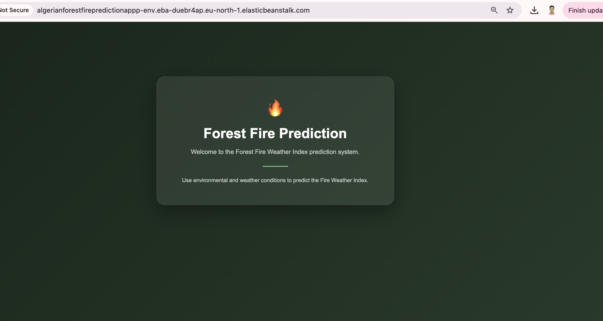
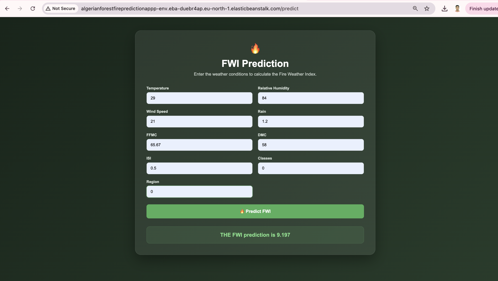
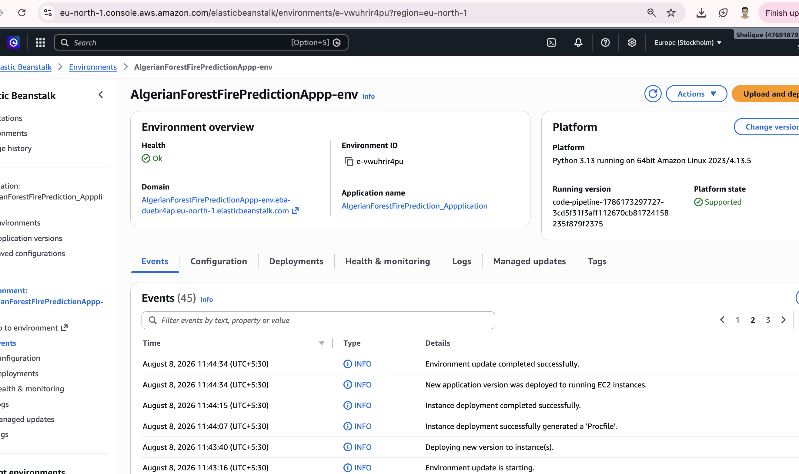
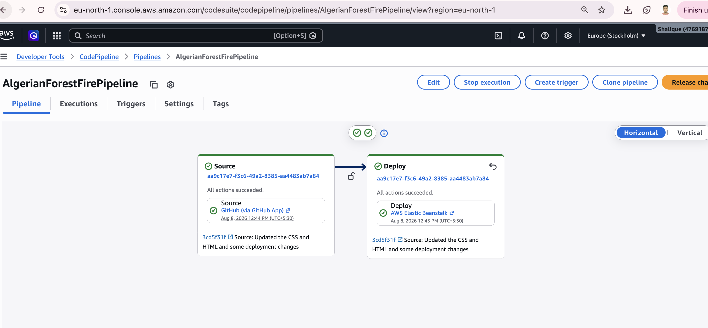

# 🔥 Algerian Forest Fire Prediction

A Machine Learning project to predict the **Fire Weather Index (FWI)** using weather conditions and other fire-related features from historical data of Algeria.

This project was built as part of my Machine L
earning learning journey, where I tried to understand the complete process from **data preprocessing and model training to building a Flask application and deploying it on AWS**.

---

## 🎯 Project Objective

The main objective of this project is to predict the **Fire Weather Index (FWI)** for the Bejaia and Sidi Bel-abbes regions in Algeria.

FWI is used to understand how suitable the current weather conditions are for forest fires.

For this project, I used weather-related features such as:

- Temperature
- Relative Humidity
- Wind Speed
- Rain
- FFMC
- DMC
- DC
- ISI
- BUI

The basic idea is:

**Weather Conditions → Machine Learning Model → Predicted FWI**

The main purpose of this project was also to understand the complete workflow of a Machine Learning project, including data preprocessing, model training, evaluation, model saving, Flask integration, and cloud deployment.

---

## 📊 Dataset

The dataset contains information about weather conditions and Fire Weather Index values for the **Bejaia** and **Sidi Bel-abbes** regions of Algeria.

The data mainly contains observations from **June to September 2012**.

### Features

| Feature | Description |
|---|---|
| Temperature | Temperature recorded for the day |
| RH | Relative Humidity |
| Ws | Wind Speed |
| Rain | Amount of rainfall |
| FFMC | Fine Fuel Moisture Code |
| DMC | Duff Moisture Code |
| DC | Drought Code |
| ISI | Initial Spread Index |
| BUI | Buildup Index |
| FWI | Fire Weather Index (Target) |

---

## 🧹 Data Preprocessing

Before training the models, I performed some basic preprocessing on the dataset.

Some of the steps included:

- Checking the dataset structure
- Checking for missing values
- Checking duplicate values
- Checking and handling outliers
- Removing unnecessary columns
- Separating features and target variable
- Splitting the data into training and testing sets
- Feature scaling

For feature scaling, I used **RobustScaler**, as the dataset contained some outliers.

---

## 🔍 Exploratory Data Analysis

I also performed some basic Exploratory Data Analysis (EDA) to understand the dataset and the relationship between different features.

Some of the things explored were:

- Distribution of features
- Outliers
- Correlation between features
- Relationship between weather conditions and FWI
- Feature distributions

---


# 🤖 Model Training

I experimented with different regression models to see how they performed on the dataset.

The models used were:

- Linear Regression
- Lasso Regression
- LassoCV
- RidgeCV

The models were trained using the scaled training data.

---

# 📈 Model Evaluation

For evaluating the models, I used:

### Mean Absolute Error (MAE)

MAE tells us the average absolute difference between the actual and predicted values.

Lower MAE is better.

### R² Score

R² gives an idea of how well the model explains the variation in the target variable.

A value closer to 1 generally indicates better performance.

---

## 📊 Model Results

One of the better performing models in the notebook was Linear Regression.

Its result was approximately:

    MAE = 0.5468
    R²  = 0.9848

Lasso Regression gave:

    MAE = 1.1332
    R²  = 0.9492

RidgeCV gave:

    MAE = 0.5642
    R²  = 0.9843

The models were compared based on their evaluation results.

---

# 🏆 Final Model

After experimenting with the different regression models, I used **RidgeCV** as the final model for the project.

RidgeCV was trained using the scaled training data and then evaluated on the test data.

The model was then saved using Python's `pickle` module so that it could be reused later without training the model again.

---

## 💾 Model Saving

After comparing the regression models, I selected the RidgeCV model as the final model.

I then saved the trained model and the StandardScaler using Python's `pickle` module so they could be reused later for making predictions.

The saved model files are:

    model/
    ├── ridge.pkl
    └── scaler.pkl

These files are used later by the Flask application for preprocessing the input data and making predictions.

---

## 🌐 Flask Web Application

After completing the Machine Learning part, I created a simple web application using **Flask**.

The purpose of the application is to take the required weather-related inputs from the user and use the trained Machine Learning model to predict the Fire Weather Index (FWI).

The basic flow is:

    User Input
        ↓
    Flask Application
        ↓
    Feature Scaling
        ↓
    RidgeCV Model
        ↓
    FWI Prediction
        ↓
    Result

The main Flask application is:

    application.py

The HTML files are:

    templates/
    ├── home.html
    └── index.html

The CSS file is:

    static/
    └── style.css

---

## 🖥️ Application

The Flask application provides a simple interface where users can enter the required input values.

The application then:

1. Takes the input from the user.
2. Converts the values into the required format.
3. Applies the saved scaler.
4. Passes the scaled data to the trained RidgeCV model.
5. Returns the predicted Fire Weather Index.

---


Here are some screenshots of the Web application:

<p align="center">
  
</p>

<p align="center">
  
</p>

## 📁 Project Structure

```text
AlgerianForestFire/
│
├── Dataset/
│   └── Algerian_forest_fires_dataset_UPDATE.csv
│
├── Model/
│   ├── ridge.pkl
│   └── scaler.pkl
│
├── Notebook/
│   └── model_creation.ipynb
│
├── .ebextensions/
│   └── python.config
│
├── static/
│   └── style.css
│
├── templates/
│   ├── home.html
│   └── index.html
│
├── application.py
├── requirements.txt
└── README.md
```

---

## ⚙️ Technologies Used

### Programming Language

- Python

### Data Analysis

- Pandas
- NumPy

### Machine Learning

- Scikit-learn

### Visualization

- Matplotlib
- Seaborn

### Web Development

- Flask
- HTML
- CSS

### Deployment

- AWS Elastic Beanstalk
- AWS CodePipeline
- AWS IAM
- Amazon S3
- GitHub

---

## 🚀 How to Run Locally

### 1. Clone the repository

    git clone <your-github-repository-url>

### 2. Go to the project directory

    cd AlgerianForestFire

### 3. Create a virtual environment

    python -m venv venv

### 4. Activate the virtual environment

For macOS/Linux:

    source venv/bin/activate

For Windows:

    venv\Scripts\activate

### 5. Install the required libraries

    pip install -r requirements.txt

### 6. Run the Flask application

    python application.py

The application should start on:

    http://127.0.0.1:5000/

Open the URL in your browser.

---

# ☁️ AWS Deployment

After completing the Machine Learning and Flask application, I deployed the project using **AWS Elastic Beanstalk**.

This helped me understand how a Machine Learning application can be deployed and accessed through the cloud.

### AWS Services Used

- AWS Elastic Beanstalk
- AWS CodePipeline
- Amazon S3
- AWS IAM
- AWS CodeConnections
- GitHub

---

## 🌱 AWS Elastic Beanstalk

I created an Elastic Beanstalk application and environment for the Flask application.

The application was deployed as a:

**Web Server Environment**

The environment used an EC2 instance running the Flask application.

The Flask application was configured using Python and Nginx.

### 📸 Elastic Beanstalk Environment

The application was successfully deployed and running on an AWS Elastic Beanstalk environment.

<p align="center">
  
</p>

---

## 🔄 CI/CD with AWS CodePipeline

I also created a CI/CD pipeline using AWS CodePipeline.

The basic workflow is:

    GitHub
       ↓
    AWS CodePipeline
       ↓
    AWS Elastic Beanstalk
       ↓
    Flask Application
       ↓
    Machine Learning Model

The GitHub repository is connected to CodePipeline using **AWS CodeConnections**.

This allows changes pushed to the GitHub repository to be passed through the pipeline and deployed to the Elastic Beanstalk environment.

<p align="center">
  
</p>

---

## 🔐 IAM and Permissions

During the AWS deployment, I also learned about IAM roles and permissions.

Some of the concepts I worked with were:

- CodePipeline service roles
- Elastic Beanstalk service roles
- EC2 instance profiles
- IAM policies
- S3 permissions
- CodeConnections permissions
- Elastic Beanstalk permissions

I also had to troubleshoot permission-related issues while setting up the CI/CD pipeline.

This helped me understand how different AWS services communicate with each other and why the correct IAM permissions are important.

### 📸 CodePipeline IAM Role

During the deployment, I created and configured an IAM service role for CodePipeline with the permissions required for the deployment.

<p align="center">
  
</p>

---

## 🏗️ Deployment Architecture

The overall deployment flow looks like this:

    GitHub
       │
       ▼
    AWS CodePipeline
       │
       ▼
    AWS Elastic Beanstalk
       │
       ▼
    EC2 Instance
       │
       ▼
    Flask Application
       │
       ▼
    Saved ML Model
       │
       ▼
    FWI Prediction


---

## 🌐 Live Application

The application was deployed using AWS Elastic Beanstalk.

Live URL:

    <http://algerianforestfirepredictionappp-env.eba-duebr4ap.eu-north-1.elasticbeanstalk.com/>
    <http://algerianforestfirepredictionappp-env.eba-duebr4ap.eu-north-1.elasticbeanstalk.com/predict/>


---

## 📚 What I Learned

This project helped me understand the complete workflow of a Machine Learning project.

### Machine Learning

- Data preprocessing
- Handling missing values
- Exploratory Data Analysis
- Feature selection
- Handling multicollinearity
- Feature scaling
- Train-test splitting
- Linear Regression
- Lasso Regression
- Ridge Regression
- RidgeCV
- Model evaluation
- Saving models using Pickle

### Flask

- Creating Flask routes
- Handling GET and POST requests
- Getting data from HTML forms
- Connecting a Machine Learning model with Flask
- Using HTML templates
- Using CSS for the frontend

### AWS

- AWS Elastic Beanstalk
- EC2 basics
- IAM roles and permissions
- Amazon S3
- AWS CodePipeline
- AWS CodeConnections
- CI/CD
- Cloud deployment
- Troubleshooting deployment issues

---

## ⚠️ Challenges I Faced

One of the more challenging parts of this project was deploying the application on AWS.

I faced issues related to:

- IAM permissions
- CodePipeline service roles
- Elastic Beanstalk deployment
- S3 artifact permissions
- GitHub connections
- Flask configuration
- Application paths

Working through these issues helped me understand that deploying a Machine Learning project involves more than just training a model.

The different AWS services also need to be configured correctly and need the appropriate permissions to communicate with each other.

---

## 🔮 Future Improvements

Some improvements I would like to make in the future:

- Improve the frontend design
- Try additional Machine Learning models
- Perform more feature engineering
- Improve model performance
- Add better input validation
- Add more visualizations
- Add automated testing
- Improve the CI/CD pipeline
- Add better monitoring and logging

---

## 👨‍💻 Author

**Md Shalique**

This project was created as part of my Machine Learning learning journey.

---

## ⭐ Conclusion

This project helped me understand the complete journey of a Machine Learning project:

    Dataset
       ↓
    Data Preprocessing
       ↓
    Exploratory Data Analysis
       ↓
    Feature Selection
       ↓
    Feature Scaling
       ↓
    Model Training
       ↓
    Model Evaluation
       ↓
    Model Selection
       ↓
    Model Saving
       ↓
    Flask Application
       ↓
    AWS Elastic Beanstalk
       ↓
    AWS CodePipeline
       ↓
    Deployment

Overall, this was a good learning experience because I got to work on both the **Machine Learning side and the deployment side** of the project.